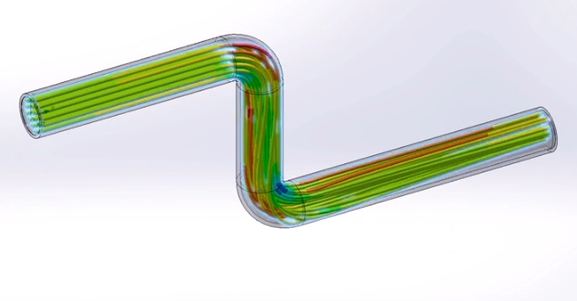

# 3D CFD Pipe Spool Flow Simulation


An interactive, real-time 3D Computational Fluid Dynamics (CFD) flow visualization application written in C++17 and powered by Raylib & OpenGL.

This application simulates progressive fluid front propagation, velocity gradients, and streamline behavior inside a complex CAD pipe spool assembly featuring 90-degree elbows and a T-junction.

---

## Preview



---

## Features

- **Progressive Fluid Front Propagation**: Realistic fluid advancement filling the pipe from inlet to outlets, splitting naturally at the T-junction.
- **Smooth Bezier Arc Fillets**: 90-degree elbows modeled with Quadratic Bezier curves for continuous, non-angular streamline curvature.
- **Dynamic Velocity-Color Scale**: Streamline colors adapt in real time to fluid velocity (Blue = 0 m/s, Green = 15 m/s, Red = 30 m/s).
- **Interactive Flow Speed Slider**: Real-time speed control with dynamic velocity recoloring.
- **Light & Dark Theme Toggle**: Switch between Dark Studio Mode and Light Studio Mode.
- **Glass Pipe Rendering**: Semi-transparent 3D CAD body with depth-mask blending for internal streamline visibility.
- **Manual 3D Camera Controls**: Orbit, pan, and zoom around the pipe using the mouse, with optional Auto-Rotation.
- **Native GUI Window**: Compiles directly as a clean Windows GUI executable without background CMD console windows.

---

## Tech Stack & Requirements

- **Language**: C++17
- **Graphics Library**: Raylib 5.0 (Fetched automatically via CMake)
- **Build System**: CMake 3.20+
- **Compiler**: MSVC (Visual Studio 2022 / 2026) or MinGW GCC
- **Asset Format**: Wavefront 3D OBJ (`pipe.obj`)

---

## Building & Running

### Option 1: Quick Build via CMake (Command Line)

```powershell
# Clone the repository
git clone https://github.com/inkpiano123-star/flow-simulation.git
cd flow-simulation

# Configure and generate build files
cmake . --fresh -D CMAKE_POLICY_VERSION_MINIMUM=3.5

# Build Release configuration
cmake --build . --config Release

# Run application
.\Release\FlowSim.exe
```

### Option 2: Visual Studio

1. Open `FlowSim.slnx` or `FlowSim.vcxproj` in Visual Studio 2022 / 2026.
2. Select **Release** | **x64**.
3. Press **F5** or click **Local Windows Debugger** to run.

---

## Controls

| Action | Control |
| :--- | :--- |
| **Orbit Camera** | Left-Click / Right-Click + Drag Mouse |
| **Zoom Camera** | Mouse Wheel |
| **Speed Slider** | Left-Click + Drag Slider handle at bottom |
| **Auto-Rotate** | Click `Auto-Rotate: OFF / ON` button |
| **Theme Toggle** | Click `Theme: Dark Mode / Light Mode` button |

---

## License

This project is licensed under the MIT License - see the [LICENSE](LICENSE) file for details.
Copyright (c) 2026.
